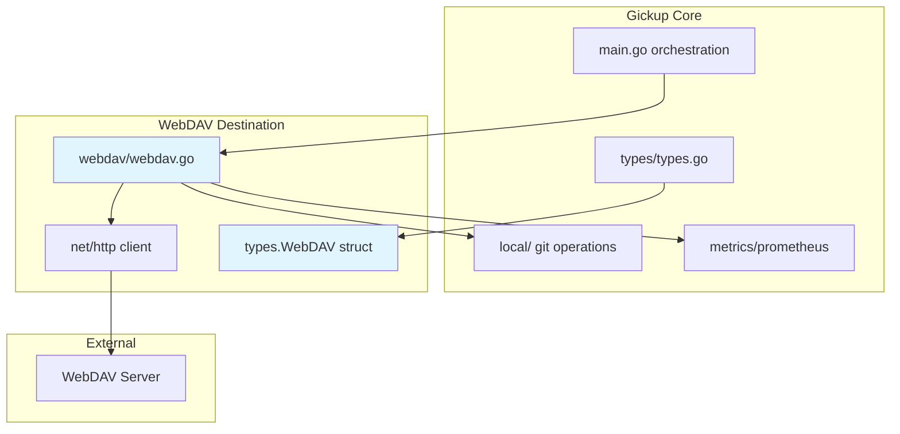

# Design Document: WebDAV Destination

## Overview

This feature adds WebDAV as a destination target for Gickup, enabling users to backup mirrored Git repositories to WebDAV servers. The implementation follows the established storage backend pattern used by S3 and Azure Blob storage, leveraging Go's standard `net/http` package for HTTP operations with WebDAV-specific methods.

**Purpose**: Users can configure WebDAV servers as backup destinations, with support for basic authentication, digest authentication, and client certificate authentication. Repositories are uploaded via HTTP PUT requests with proper directory structure creation using MKCOL.

**Users**: Gickup users who need to backup repositories to WebDAV-compatible servers (e.g., ownCloud, Nextcloud, Apache WebDAV, nginx dav module)

**Impact**: Adds new destination type to the existing multi-destination backup system; no modifications to source handlers or existing destination behaviors.

### Goals
- Add WebDAV as a configurable destination in YAML configuration
- Support authentication via Basic Auth, Digest Auth, and Client Certificates
- Upload Git repositories to WebDAV servers using HTTP methods (PUT, MKCOL, PROPFIND, DELETE)
- Implement retry logic with exponential backoff for transient failures
- Integrate with existing metrics, logging, and orchestration infrastructure

### Non-Goals
- WebDAV server implementation (client-only feature)
- Complex locking or versioning operations beyond basic upload/delete
- WebDAV property manipulation beyond existence checks
- Streaming large files with pause/resume capability

---

## Architecture

### Existing Architecture Analysis

Gickup follows a domain-driven separation where each storage backend is isolated in its own package. The current architecture supports:
- **Source Handlers**: github, gitlab, gitea, gogs, bitbucket, onedev, sourcehut, any
- **Destination Handlers**: local, github, gitlab, gitea, gogs, onedev, sourcehut, s3, azureblob
- **Orchestration**: Single-entry point in main.go iterates sources and destinations

The Destination struct in types/types.go (line 24-34) holds configuration slices for each destination type. Each storage backend package provides upload and cleanup functions called from main.go's orchestration loop.

### Architecture Pattern & Boundary Map



**Selected Pattern**: Storage Backend Extension
**Domain Boundaries**: WebDAV operations isolated in `webdav/` package; configuration in `types/` package
**Existing Patterns Preserved**: UploadDir function signature, client creation pattern, metrics integration
**New Components Rationale**: webdav/ package contains all WebDAV-specific logic; types/ extension adds configuration struct
**Steering Compliance**: Follows domain-first separation (VCS/storage packages), lowercase package naming, co-located tests

### Technology Stack

| Layer | Choice / Version | Role in Feature | Notes |
|-------|------------------|-----------------|-------|
| HTTP Client | `net/http` (standard library) | WebDAV communication | No external library needed |
| TLS | `crypto/tls` (standard library) | Client certificate support | PEM/PKCS12 file handling |
| Authentication | Custom implementation | Basic, Digest, Cert auth | HTTP headers with base64 encoding |
| Configuration | `types/types.go` extension | YAML config structure | Follows S3Repo/AzureBlob pattern |
| Logging | `zerolog` (existing) | Structured logging | Sub-logger with webdav stage |
| Metrics | `prometheus/client_golang` (existing) | Backup metrics | New label value "webdav" |

---

## Requirements Traceability

| Requirement | Summary | Components | Interfaces | Flows |
|-------------|---------|------------|------------|-------|
| 1 | WebDAV destination configuration | WebDAVConfig, Main | YAML struct tag | Config loading |
| 2 | Connection and authentication | HTTPClient, WebDAVPackage | Auth interfaces | Connection verification |
| 3 | Repository push to WebDAV | WebDAVPackage | UploadDirToWebDAV | Upload flow |
| 4 | WebDAV feature compatibility | HTTPClient, WebDAVPackage | Headers, redirects | Feature handling |
| 5 | Error handling and logging | WebDAVPackage, Metrics | Retry logic, zerolog | Error flow |
| 6 | Configuration validation | WebDAVConfig | URL validation | Startup validation |

---

## Components and Interfaces

### Component Summary

| Component | Domain/Layer | Intent | Req Coverage | Key Dependencies | Contracts |
|-----------|--------------|--------|--------------|------------------|-----------|
| WebDAV | Configuration | Define WebDAV destination config | 1, 6 | types (P0) | Struct |
| WebDAVClient | HTTP Client | Manage server connections | 2, 4 | net/http, crypto/tls (P0) | Service |
| UploadDirToWebDAV | Upload Logic | Upload directory contents | 3, 4 | WebDAVClient (P0), Local (P1) | Service |
| DeleteObjectsNotInRepo | Cleanup Logic | Remove orphaned files | 3 | WebDAVClient (P0) | Service |

---

### Configuration Domain

#### WebDAV Struct

| Field | Detail |
|-------|--------|
| Intent | Define WebDAV destination configuration for YAML parsing |
| Requirements | 1.1, 1.2, 1.3, 1.4, 1.5, 6.1, 6.2, 6.4 |

**Responsibilities & Constraints**:
- Holds URL, authentication credentials, and path prefix
- Validates URL format (http:// or https://) at startup
- Supports environment variable resolution for credentials
- Maps to YAML structure matching other storage backends

**Dependencies**:
- Inbound: types.Destination (P0) - embedding in destination struct
- Outbound: None

**Contracts**: Struct [x]

```go
type WebDAV struct {
    URL           string `yaml:"url"`
    Username      string `yaml:"username"`
    Password      string `yaml:"password"`
    CertFile      string `yaml:"certfile"`
    CertPassword  string `yaml:"certpassword"`
    PathPrefix    string `yaml:"pathprefix"`
    Structured    bool   `yaml:"structured"`
    Zip           bool   `yaml:"zip"`
    DateCreateDir bool   `yaml:"datecreatedir"`
}
```

**Implementation Notes**:
- CertFile supports PEM and PKCS12 formats
- PathPrefix defaults to empty string (root of WebDAV server)
- Structured and DateCreateDir match S3Repo/AzureBlob semantics

---

### HTTP Client Domain

#### WebDAVClient Service

| Field | Detail |
|-------|--------|
| Intent | Manage authenticated HTTP connections to WebDAV servers |
| Requirements | 2.1, 2.2, 2.3, 2.4, 2.5, 4.1, 4.2, 4.3, 4.5 |

**Responsibilities & Constraints**:
- Establish connections with appropriate authentication
- Handle HTTP redirects (301, 302, 307, 308)
- Set WebDAV-specific headers (Depth, If-Match)
- Validate server responses and return appropriate errors
- Support configurable timeouts (30s connect, 5min request)

**Dependencies**:
- Outbound: net/http.Client (P0) - HTTP communication
- Outbound: crypto/tls (P0) - client certificate handling
- External: WebDAV Server (P0) - remote endpoint

**Contracts**: Service [x] / API [ ] / Event [ ] / Batch [ ] / State [ ]

##### Service Interface

```go
type WebDAVClient interface {
    Mkcol(ctx context.Context, path string) error
    Put(ctx context.Context, path string, body io.Reader, contentType string) error
    Propfind(ctx context.Context, path string) (*DavResponse, error)
    Delete(ctx context.Context, path string) error
    Exists(ctx context.Context, path string) (bool, error)
    Close() error
}

type DavResponse struct {
    StatusCode int
    Properties map[string]string
}
```

##### HTTP Request Contract

| Method | Path Pattern | Request | Response | Errors |
|--------|--------------|---------|----------|--------|
| MKCOL | /{path} | Empty | 201 Created, 405 Method | 401, 403, 507 |
| PUT | /{path} | File content | 201 Created, 204 No Content | 401, 403, 507 |
| PROPFIND | /{path} | XML body | 207 Multi-Status | 401, 403, 404 |
| DELETE | /{path} | Empty | 204 No Content | 401, 403, 404 |

**Implementation Notes**:
- Digest auth requires initial 401 challenge response to extract nonce
- Client certificate loaded via tls.LoadX509KeyPair or tls.X509KeyPair
- Redirect handling: POST/PUT redirects converted to GET (unsafe for 302)
- Timeout configuration: 30 second connection timeout, 5 minute request timeout

---

### Upload Logic Domain

#### UploadDirToWebDAV Function

| Field | Detail |
|-------|--------|
| Intent | Upload directory contents to WebDAV server with proper structure |
| Requirements | 3.1, 3.2, 3.3, 3.4, 3.5, 4.1, 4.2, 4.4, 5.1, 5.2, 5.3, 5.5 |

**Responsibilities & Constraints**:
- Walk local directory tree (similar to S3/AzureBlob patterns)
- Create remote directories via MKCOL before uploading files
- Upload files via PUT with appropriate content type
- Handle LFS objects as regular files (no special processing)
- Retry failed uploads with exponential backoff (3 attempts)
- Verify upload success via HTTP status code validation
- Support optional zip compression before upload

**Dependencies**:
- Inbound: types.Repo (P0) - repository metadata
- Inbound: types.WebDAV (P0) - destination configuration
- Outbound: WebDAVClient (P0) - upload operations
- Outbound: local (P1) - temp clone path access

**Contracts**: Service [x] / API [ ] / Event [ ] / Batch [ ] / State [ ]

##### Service Interface

```go
func UploadDirToWebDAV(
    ctx context.Context,
    directory string,
    repo types.Repo,
    config types.WebDAV,
    client WebDAVClient,
) error
```

**Implementation Notes**:
- File path conversion: local filepath separators to WebDAV forward slashes
- Parallel uploads: consider concurrent PUT requests for multiple files
- Progress logging: log each file upload with name and size
- Retry logic: 1s, 2s, 4s delay between attempts with jitter
- Structured logging: use zerolog sub-logger with stage="webdav", url=config.URL

---

### Cleanup Logic Domain

#### DeleteObjectsNotInRepo Function

| Field | Detail |
|-------|--------|
| Intent | Remove files from WebDAV server that no longer exist locally |
| Requirements | 3.4 |

**Responsibilities & Constraints**:
- List remote resources via PROPFIND
- Compare with local directory contents
- Delete orphaned remote files
- Handle missing remote resources gracefully

**Dependencies**:
- Inbound: types.Repo (P0) - repository name for path resolution
- Inbound: types.WebDAV (P0) - path prefix configuration
- Outbound: WebDAVClient (P0) - PROPFIND and DELETE operations

**Contracts**: Service [x] / API [ ] / Event [ ] / Batch [ ] / State [ ]

##### Service Interface

```go
func DeleteObjectsNotInRepo(
    ctx context.Context,
    directory string,
    repo types.Repo,
    config types.WebDAV,
    client WebDAVClient,
) error
```

**Implementation Notes**:
- PROPFIND with Depth:1 lists all resources in collection
- Compare remote paths (with prefix) against local file paths
- Silent failure for already-deleted resources (410 Gone)
- Batch delete not supported; single DELETE per resource

---

## Data Models

### Domain Model

```
WebDAV Destination
├── URL: WebDAV server base URL
├── Credentials (optional)
│   ├── Username/Password (Basic/Digest)
│   └── CertFile/CertPassword (TLS Client)
├── PathPrefix: Remote path prefix
└── Options
    ├── Structured: Include hoster/owner in path
    ├── Zip: Compress before upload
    └── DateCreateDir: Include date directory
```

### Logical Data Model

**Configuration Structure**:
```go
type WebDAV struct {
    URL           string  // Required: WebDAV server URL (http/https)
    Username      string  // Optional: for Basic/Digest auth
    Password      string  // Optional: resolves from env vars
    CertFile      string  // Optional: client certificate path
    CertPassword  string  // Optional: certificate passphrase
    PathPrefix    string  // Optional: remote path prefix
    Structured    bool    // Default: false
    Zip           bool    // Default: false
    DateCreateDir bool    // Default: false
}
```

**Consistency & Integrity**:
- URL validated at startup (must start with http:// or https://)
- Credentials validated: if Username set, Password required (unless CertFile)
- PathPrefix normalized: trimmed slashes, converted to WebDAV format

---

## Error Handling

### Error Strategy

| Error Category | HTTP Code | Handling |
|----------------|-----------|----------|
| Authentication Failed | 401 | Fail immediately; clear error message |
| Forbidden | 403 | Fail immediately; check permissions |
| Not Found | 404 | Create resource via MKCOL/PUT |
| Precondition Failed | 412 | Retry with If-Match:* |
| Server Error | 5xx | Retry with backoff (max 3 attempts) |
| Network Timeout | N/A | Retry with backoff |
| Rate Limited | 429 | Retry with backoff |

### Retry Logic

```go
func withRetry(ctx context.Context, operation func() error) error {
    backoff := 1 * time.Second
    maxRetries := 3

    for attempt := 0; attempt <= maxRetries; attempt++ {
        if err := operation(); err != nil {
            if isTransientError(err) && attempt < maxRetries {
                time.Sleep(backoff + jitter())
                backoff *= 2
                continue
            }
            return err
        }
        return nil
    }
    return err // Last error
}
```

### Structured Logging

```go
sub := log.With().
    Str("stage", "webdav").
    Str("url", config.URL).
    Str("repo", repo.Name).
    Logger()

sub.Info().Msgf("uploading %s to WebDAV", repo.Name)
sub.Error().Err(err).Msg("failed to upload to WebDAV")
sub.Warn().Msg("server does not support required WebDAV feature")
```

---

## Testing Strategy

### Unit Tests
- WebDAV struct validation (URL format, credential combinations)
- Path conversion (local filepath to WebDAV path)
- Retry logic (transient vs permanent errors)
- Authentication header generation (Basic, Digest, Cert)
- Directory walk and file filtering

### Integration Tests
- Full upload flow with mock WebDAV server (testdav, ch現地Dav)
- Authentication scenarios (Basic, Digest, Cert)
- Error handling (401, 403, 5xx responses)
- Concurrent uploads
- Cleanup of orphaned files

### E2E Tests
- Integration with real WebDAV server (nginx with dav, Apache, Nextcloud)
- Full backup workflow (source discovery through destination upload)
- Metrics and logging verification

---

## Security Considerations

- **Credential Handling**: Passwords resolved from environment variables (like S3 accesskey/secretkey)
- **TLS Verification**: Server certificates validated by default; option to skip for self-signed
- **Client Certificates**: Loaded from encrypted PEM/PKCS12 files
- **No Credential Logging**: Passwords never logged; use placeholder in debug output
- **HTTPS Enforcement**: Recommend https:// for production use

---

## Performance & Scalability

- **Concurrent Uploads**: Support parallel PUT requests (configurable, default 4)
- **Streaming Uploads**: Files streamed from disk to HTTP request body
- **Memory Efficiency**: Large files uploaded in chunks via io.Reader
- **Connection Reuse**: http.Client with connection pooling (keep-alive)

---

## Supporting References

### WebDAV Specification
- [RFC 4918 - WebDAV](https://www.rfc-editor.org/rfc/rfc4918.html)
- [HTTP Authentication](https://www.rfc-editor.org/rfc/rfc7235.html)

### Go HTTP Client Best Practices
- [net/http documentation](https://pkg.go.dev/net/http)
- [crypto/tls documentation](https://pkg.go.dev/crypto/tls)

### Implementation Reference
- S3 pattern: `s3/s3.go` (UploadDirToS3, DeleteObjectsNotInRepo)
- AzureBlob pattern: `azureblob/azureblob.go` (UploadDirToBlobStorage, DeleteObjectsNotInRepo)
